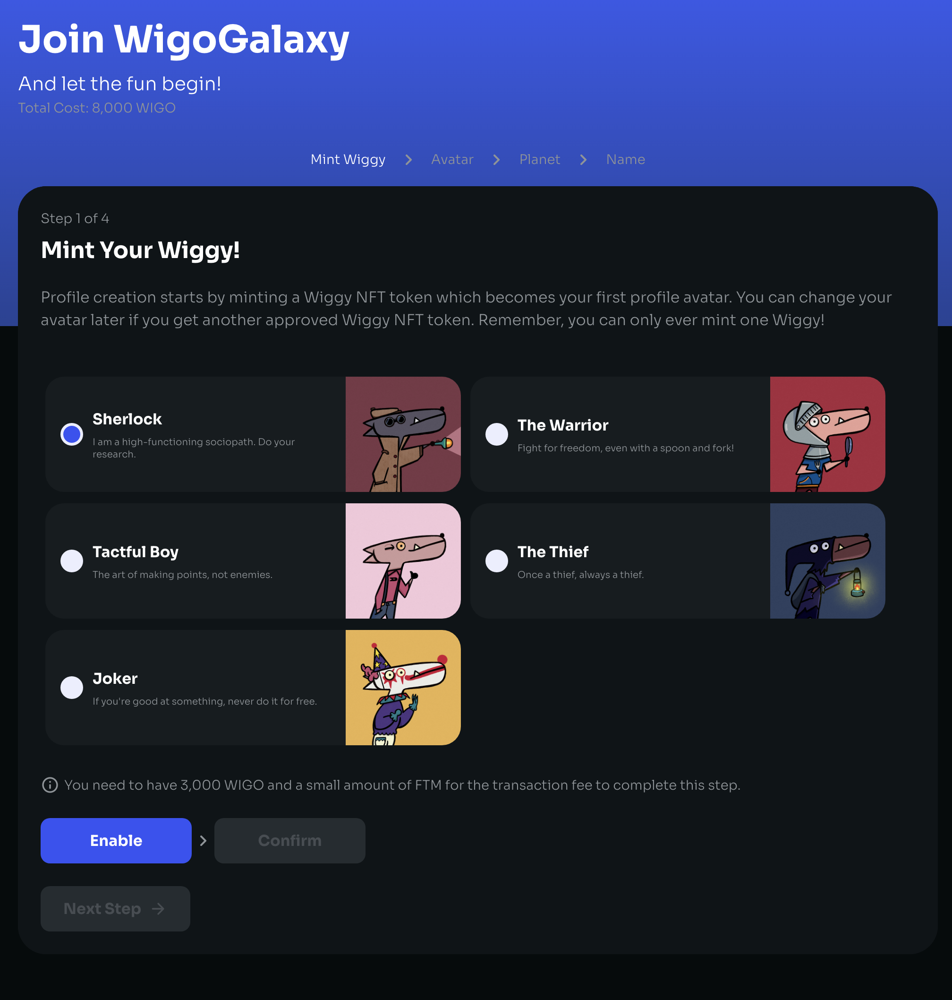
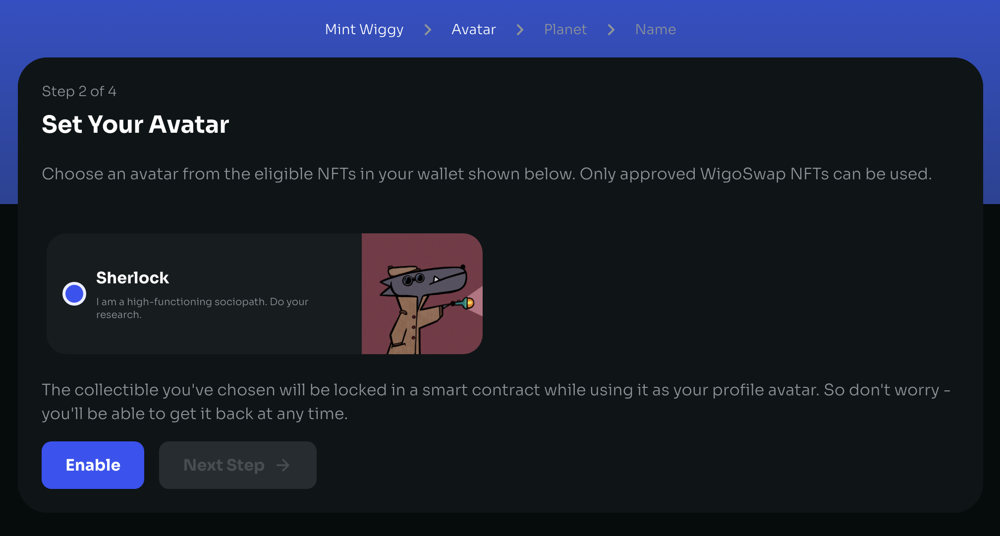
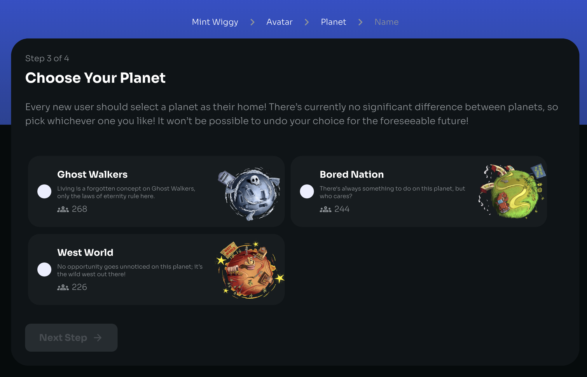
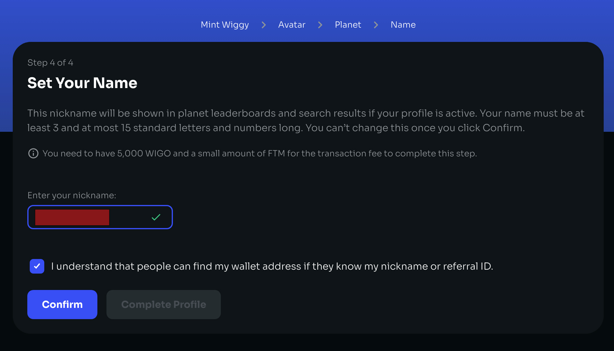
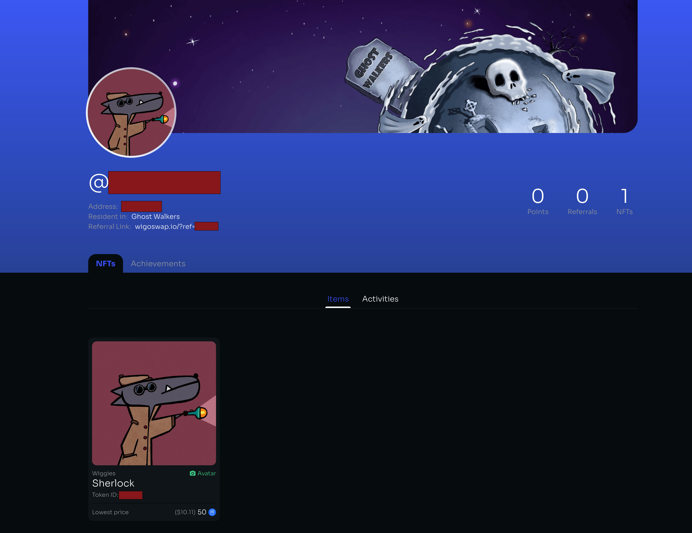

# 🎲 WigoQuest: Play and Earn

**Introduction to WigoQuest**

WigoQuest introduces a dynamic layer of gamification to the WigoSwap platform, offering users a compelling way to engage with various tasks while earning rewards. Embedded within WigoSwap, WigoQuest serves as a bridge between traditional swap functionalities and interactive, reward-based activities.

**How WigoQuest Works**

WigoQuest revolves around single quests — distinct tasks that users can complete to earn rewards. To participate, **users must first register their profile on WigoSwap**. This registration is the gateway to a plethora of quests, each designed with specific goals and rewards in mind.

**Quest Dynamics**

1. **Active and Expired Quests:** At any given time, WigoQuest features a selection of available quests, including 'hot quests' which are currently active and offer timely rewards. Quests have a defined lifecycle, starting from an active state and moving to an expired status upon reaching their deadline or completion metrics.
2. **Quest Details:**
   * Title and Information: Each quest is clearly outlined with a title and additional details provided in a subheader, guiding users through the requirements and rewards.
   * NFT Minting: A unique aspect of WigoQuest is the NFT reward system. The platform displays the number of NFTs minted for each quest, indicating the quest's popularity and the number of users who have successfully claimed the reward.
   * Start and End Dates: Quests are time-bound, with a specified start date and either a fixed or open-ended completion date. This structure ensures a steady refresh of opportunities for users to engage with.
3. **Rewards:**
   * WigoQuest offers a diverse rewards system primarily focused on NFTs and points. Each quest outlines its reward structure, providing clear incentives for participation.
4. **Claiming Rewards:**
   * Upon completing a quest, users are prompted to claim their rewards, further integrating the WigoQuest experience with the user's achievements visible on their profile.
5. **Integration with the profile (WigoGalaxy):**
   * Achievements and completed quests are recorded and showcased in the user's profile on WigoSwap, offering a comprehensive view of their journey and accomplishments within the Wigo ecosystem.


**To start creating a profile please open this** [**link**](https://wigoswap.io/join)**.**&#x20;


<mark style="color:blue;">**Step 1: Minting your Wiggy (NFT Avatar)**</mark>

After connecting your wallet you should see a list of available Wiggies that you can mint in the process and choose as your initial Wiggy avatar. Select whichever you like most! Click on “Enable” to give access to WigoGalaxy to interact with your wallet. After that click on “Confirm” to confirm the process in your wallet.&#x20;

<figure><figcaption></figcaption></figure>

\
<mark style="color:blue;">**Step 2: Selecting Wiggy as your avatar**</mark>

Now you have successfully minted and owned your Wiggy, next you can see your Wiggy and select it as your profile pic. In this step by clicking on “Enable” you will lock your NFT on WigoSwap to be able to use it as your avatar. Don’t worry, you can unlock it whenever you want. Now click on the next step.

<figure><figcaption></figcaption></figure>

\
<mark style="color:blue;">**Step 3: Choosing your planet!**</mark>

Creating a profile on WigoSwap is in fact the process of joining WigoGalaxy, so every new user should select a planet as their home! There’s currently no significant difference between planets, so pick whichever one you like! It won’t be possible to undo your choice for the foreseeable future!

<figure><figcaption></figcaption></figure>

\
<mark style="color:blue;">**Step 4: Choose your nickname**</mark>

What should we call you on WigoGalaxy? Choose your preferred username. This nickname will be shown in planet leaderboards and search results if your profile is active. Your name must be at least 3 and at most 15 standard letters and numbers long. You can’t change this once you click Confirm.

<figure><figcaption></figcaption></figure>


**Note: People can find your wallet address if they know your nickname or referral ID. So please be careful about this and agree with that by enabling the warning check box.**&#x20;


\
\
Click “Confirm” to approve your username through your wallet. Your username is submitted and the last action is clicking on “Complete Profile” → “Enable” & “Confirm” to pay the profile creation fee. \

\
**Congrats! Your WigoGalaxy profile is now live! Enjoy.**\

<figure><figcaption></figcaption></figure>

**Conclusion**

WigoQuest is more than just a gamification feature; it's a strategic engagement tool that enriches the WigoSwap experience, marrying the utility of DeFi with the enjoyment of completing quests and earning rewards. Through on-chain and off-chain quests, users not only participate in the Wigo ecosystem but also contribute to its vibrancy and growth. WigoQuest is an innovative step towards making DeFi accessible, enjoyable, and rewarding for a broader audience.
